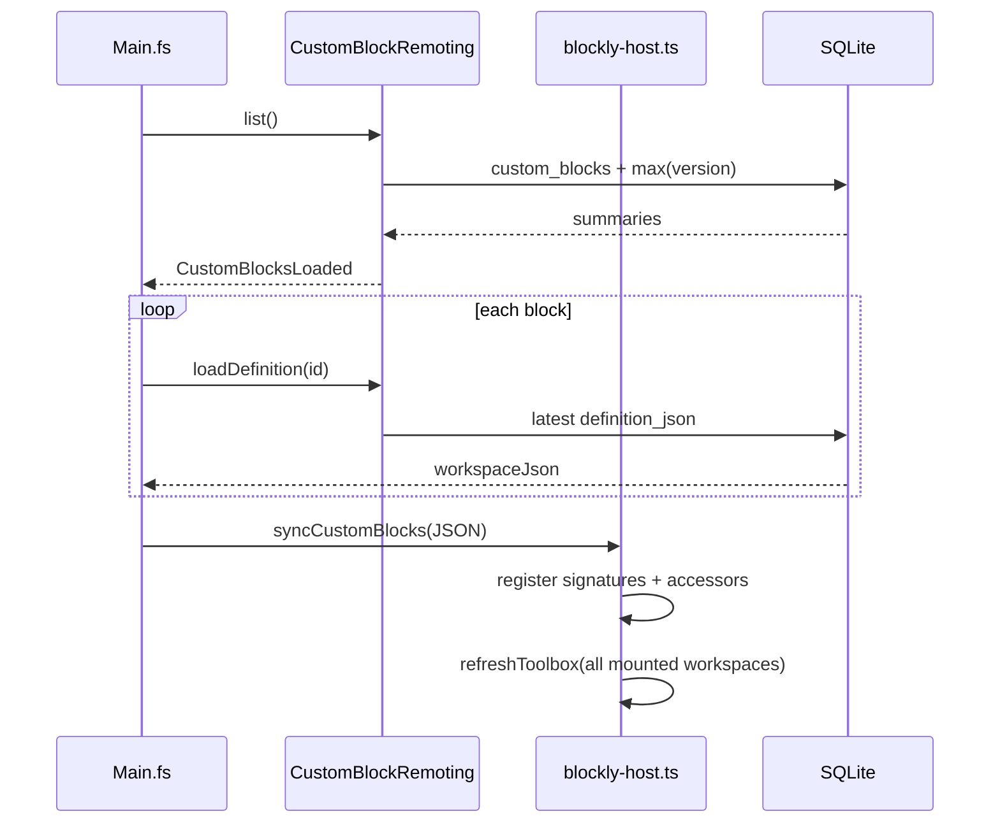

# Custom block toolbox, persistence seeding, and no-op save

Domain knowledge from the July 2026 session that fixed three related custom-block
behaviors. Commits: `5bdc63e`, `19c36de`, `d4a138e`.

Read this before touching the Blockly toolbox, `blockly-host.ts`'s custom-block
surface, `CustomBlockRemoting.fs`, or `CustomBlockRepository.fs`.

## Problem summary

Three user-visible issues, one underlying architectural split:

| Symptom | Root cause |
|---------|------------|
| Program workspace showed an **"Eigener Block"** toolbox category (definition shell, param get, build record) | Both program and Blockwerkstatt workspaces used the same `buildCatalogToolbox` output |
| **"Eigene Blöcke"** was empty after reload even when blocks existed in SQLite | Caller toolbox entries lived only in per-workspace in-memory maps, seeded on workshop save — not from DB on startup |
| Saving an unchanged custom block bumped the version number | Every save always appended a new `custom_block_versions` row |

## Architectural model (unchanged intent, now enforced in UI)

Custom blocks have two Blockly surfaces with different jobs:

```txt
Blockwerkstatt (workshop)
  - Edit the definition: sk_custom_block_def + body in Ergebnis/Inhalt
  - Toolbox includes "Eigener Block" (definition blocks) AND "Eigene Blöcke" (callers)

Program workspace
  - Compose programs using saved custom blocks as callers only
  - Toolbox includes "Eigene Blöcke" (callers) but NOT "Eigener Block"
```

Definitions never live inline in a program's workspace JSON (see `plan.md` §18 and
`docs/05-agent-handoff.md`). The toolbox split makes that rule obvious in the UI:
players cannot drag a definition shell into a program canvas.

### German / English labels

| Concept | German (UI) | English (UI) |
|---------|-------------|--------------|
| Definition category | Eigener Block | Custom block |
| Saved callers category | Eigene Blöcke | Custom blocks |
| Workshop view | Blockwerkstatt | Block workshop |

See `docs/06-localization.md` for the full glossary.

## Change 1 — Toolbox split (program vs Blockwerkstatt)

### Files

- `src/SpaceKids.Client/Blockly/toolbox-de.ts` — `buildCatalogToolbox(..., options)`
- `src/SpaceKids.Client/Blockly/blockly-host.ts` — `toolboxOptionsFor(containerId)`
- `src/SpaceKids.Client/Main.fs` — `workshopContainerId = "blockly-workshop-spike"`

### Mechanism

`buildCatalogToolbox` gained an optional `CatalogToolboxOptions.includeDefinitionCategory`.
When `false` (default), the definition category is omitted from the toolbox JSON:

```txt
sk_custom_block_def   — definition shell (mutator gear icon)
sk_param_get          — read a typed input inside the definition
sk_build_record       — build a structured output record
```

When `true`, that category is inserted before **"Eigene Blöcke"**.

`blockly-host.ts` decides per container:

```ts
const WORKSHOP_CONTAINER_ID = "blockly-workshop-spike";
// includeDefinitionCategory: true only for the workshop container
```

`refreshToolbox` passes `toolboxOptionsFor(containerId)` into every `buildCatalogToolbox`
call, so program workspaces (each program's `containerId` is its own DB id) never get
definition blocks, while the workshop always does.

**Invariant:** `WORKSHOP_CONTAINER_ID` must stay in sync with `Main.fs`'s
`workshopContainerId`. A mismatch silently gives the wrong toolbox to the workshop.

### What did not change

- **"Eigene Blöcke"** remains on both workspaces — it lists `callCustomBlock` flyout
  entries, one per saved custom block id.
- Dynamic structured-output accessor blocks (§9 Outputs) still append to **"Zugriffe"**
  on both workspaces when a custom block exposes fields.

## Change 2 — Seed "Eigene Blöcke" from persistence

### The bug

Before this fix, caller toolbox state was populated two ways:

1. **`publishCustomBlockSignature`** — after a successful workshop save, reads the live
   workshop workspace, registers the signature in the TS `signatureCache`, and injects
   the caller + accessor blocks into the *currently open* program workspace's toolbox.
2. **Per-container maps** — `customBlocksByContainer` and `dynamicAccessorTypesByContainer`
   in `blockly-host.ts`, cleared when a workspace is disposed/remounted.

On a fresh page load, `LoadCustomBlocks` fetched the library list from the server but
never re-derived signatures from stored workshop JSON. Any remount of a program workspace
left **"Eigene Blöcke"** empty until the user saved again from the Blockwerkstatt.

### The fix — global toolbox cache + `syncCustomBlocks`

New persistent layer in `blockly-host.ts`:

```txt
globalCustomBlockToolbox      — all saved caller entries
globalDynamicAccessorTypes    — union of per-block accessor types
```

New JS API on `window.spaceKids`:

```txt
syncCustomBlocks(json: string)
```

Payload: array of `{ id, name, workspaceJson }` (one row per saved custom block).

For each entry, `syncCustomBlocks`:

1. Parses `workspaceJson` into a **temporary** Blockly workspace (not the visible UI).
2. Finds `sk_custom_block_def`, calls `readSignature` + `registerSignature`.
3. Registers dynamic accessor block types via `registerCustomBlockAccessors`.
4. Builds toolbox entries `{ id, name }` (name from signature when available).
5. Stores globals and calls `applyGlobalCustomBlocksToContainer` for every mounted
   workspace.

`initWorkspace` (and workspace ready paths) call `applyGlobalCustomBlocksToContainer`
so a workspace that mounts *after* sync still gets the current global list.

### F# wiring (`Main.fs`)

| Piece | Role |
|-------|------|
| `CustomBlockSyncEntryDto` | DTO matching the TS payload |
| `syncCustomBlockToolbox` | For each summary from `list`, `loadDefinition` → collect JSON → `spaceKids.syncCustomBlocks` |
| `CustomBlocksLoaded` | After `customBlockRemote.list`, dispatches `syncCustomBlockToolbox` |
| `CustomBlocksToolboxSynced` | No-op completion marker after JS sync |
| App init (`on.afterRender`) | Dispatches `LoadCustomBlocks` alongside other startup loads |

Flow on startup or after library mutation (create/rename/delete/save):



`publishCustomBlockSignature` is still used on workshop save to push the *just-edited*
signature into the open program workspace immediately. That path is complementary to
`syncCustomBlocks`, not replaced by it.

### Operational note

`syncCustomBlockToolbox` performs N+1 remote calls on load (one `loadDefinition` per
block). Fine for a small personal library; if the library grows large, consider a batch
endpoint later.

## Change 3 — No-op save must not create a version

Custom block versions are append-only (`CustomBlockRepository` module comment, §9).
Bumping the version when nothing changed pollutes history and confuses the UI version
display.

### Comparison strategy

**String equality** on the raw workshop Blockly JSON (`definition_json` in
`custom_block_versions`, `workspaceJson` on the wire). No canonicalization step.

Implications:

- Identical serialization → no new row (correct for "user clicked Save without edits").
- Semantically identical but differently serialized JSON (block reorder, position-only
  drift, whitespace) → still creates a new version. Acceptable for now; a structural
  hash or normalized JSON compare would be a follow-up.

### Server layers

**`CustomBlockRepository.fs`**

| Function | Behavior |
|----------|----------|
| `currentVersion` | `COALESCE(MAX(version), 0)` for a block id |
| `latestVersionRow` | Latest `definition_json` + `compiled_body_json` |
| `saveVersionIfChanged` | If latest `definition_json` equals incoming JSON, return `currentVersion`; else `saveVersion` |
| `saveVersion` | Unchanged — always inserts next version |

**`CustomBlockRemoting.fs` `save` handler**

Two early exits before compile work:

1. After parsing top blocks, if no `sk_custom_block_def` → bilingual validation error
   (unchanged).
2. If `load` returns a definition whose `workspaceJson` equals incoming JSON → return
   `Ok currentVersion` **without** calling `deriveCustomBlockSignature`,
   `resolveCustomBlockCall`, or `saveVersionIfChanged`.

The remoting early exit avoids redundant compilation on no-op saves. The repository
guard is the persistence floor (also used if a caller reaches `saveVersionIfChanged`
with unchanged JSON).

### Test

`tests/SpaceKids.Server.Tests/Tests.fs`:

`saveVersionIfChanged keeps the version when workshop JSON is unchanged` — saves twice
with the same JSON, asserts version stays `1` and `list` reports version `1`.

### Client behavior on no-op save

`WorkshopSaved(Ok version)` still runs `publishCustomBlockSignature` and
`LoadCustomBlocks` even when the version number did not change. Harmless redundancy:
toolbox state is refreshed idempotently. A future optimization could skip those cmds
when the server signals unchanged content explicitly.

## Agent build verification (`AGENTS.md`)

Same session added rules so Server/Client/remoting changes are not handoff-ready on a
scoped test run alone:

```txt
dotnet test SpaceKids.slnx     # or at minimum dotnet build SpaceKids.slnx
Use && between build and test — not ;
Do not claim green from e.g. SpaceKids.Core.Tests alone when cross-project code changed
```

Canonical repo path: `C:\dev\space-traders` (not Grok worktrees under `~/.grok/worktrees/`).

## Quick reference — files touched

| Area | Path |
|------|------|
| Toolbox builder | `src/SpaceKids.Client/Blockly/toolbox-de.ts` |
| Blockly host / `spaceKids` API | `src/SpaceKids.Client/Blockly/blockly-host.ts` |
| Client Elmish wiring | `src/SpaceKids.Client/Main.fs` |
| Save handler | `src/SpaceKids.Server/CustomBlockRemoting.fs` |
| Persistence | `src/SpaceKids.Server/Persistence/CustomBlockRepository.fs` |
| Tests | `tests/SpaceKids.Server.Tests/Tests.fs` |
| Agent rules | `AGENTS.md` |

## Verification performed

Full solution test run after all three changes:

```txt
dotnet test SpaceKids.slnx
```

243 tests passed (includes the new `saveVersionIfChanged` case). Browser verification of
**"Eigene Blöcke"** repopulation after reload with a real user block was not scripted in
this session — worth a manual or Playwright check if regressions are suspected.

## Related reading

- `docs/04-block-catalog.md` — custom block outputs and `publishCustomBlockSignature`
- `docs/decisions.md` — Milestone 9 Blockwerkstatt rationale, versioning floor
- `docs/05-agent-handoff.md` — current product state and constraints
- `plan.md` §9 — custom reusable blocks product spec